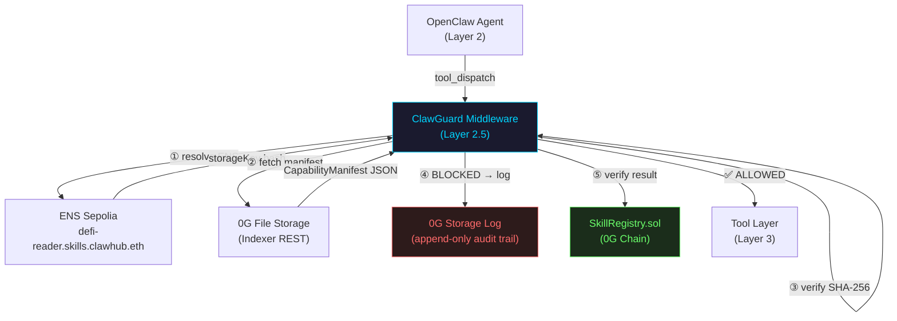

# ClawGuard 🛡️

> **Layer 2.5 Security Middleware for OpenClaw Agents**  
> Declarative capability enforcement · Tamper-proof audit logs · On-chain manifest registry · ENS skill discovery

[](https://www.npmjs.com/package/@shanejoans/clawguard)
[](https://chainscan-galileo.0g.ai)
[](https://chainscan-galileo.0g.ai/address/0x2205AC38725F42d9da0ffaDD94166B5E5b83010A)
[](https://app.ens.domains/clawhub.eth)
[](#testing)


---

## What is ClawGuard?

ClawGuard is a **middleware security layer** that wraps any OpenClaw agent's `tool_dispatch` function and enforces a **declarative capability manifest** — stopping unauthorized tool calls before they execute, logging every violation to 0G's tamper-proof storage, and anchoring all skill identities to ENS.

```
OpenClaw Agent
     │
     ▼ tool_dispatch(tool, params)
┌────────────────────────────────────────────┐
│           ClawGuard Middleware (L2.5)        │
│                                            │
│  ① Resolve ENS name → clawguard.storageKey │
│  ② Fetch manifest ← 0G File Storage REST  │
│  ③ Verify SHA-256 hash (Rule S-03)        │
│  ④ Enforce allow/block lists              │
│  ⑤ Violations → 0G Storage Log           │
└────────────────────────────────────────────┘
     │ ✅ allowed                 │ 🚫 blocked
     ▼                            ▼
  Actual tool            ViolationEvent
  execution               (immutable, on 0G)
```

---

## Architecture

```
ClawGuard/
├── packages/
│   ├── core/              # @clawguard/core — middleware, storage, ENS
│   │   └── src/
│   │       ├── manifest.ts     # SKILL.md parser + SHA-256 hashing
│   │       ├── middleware.ts   # wrapWithClawGuard() — main entry point
│   │       ├── storage.ts      # 0G Storage KV + file upload
│   │       └── ens.ts          # ENS resolution + subname registration
│   ├── contracts/         # Smart contracts + scripts
│   │   ├── src/
│   │   │   ├── SkillRegistry.sol     # On-chain manifest anchor
│   │   │   └── ENSRegistrar.ts       # ENS subname management CLI
│   │   └── deployments/
│   ├── cli/               # @clawguard/cli — developer toolchain
│   │   └── src/
│   │       ├── index.ts        # CLI entry point
│   │       ├── publish.ts      # publish: SKILL.md → 0G KV → Chain → ENS
│   │       ├── verify.ts       # verify: 0G Compute sealed inference
│   │       └── inspect.ts      # inspect: read manifest from ENS / 0G KV
│   └── example-agent/     # Demo agent with allowed + blocked skills
```

---

## Quick Start

### Prerequisites
- Node.js 18+
- A funded wallet (get testnet tokens below)

### 1. Install
```bash
git clone <repo>
cd ClawGuard
npm install
```

### 2. Configure `.env`
```bash
cp .env.example .env
# Fill in ZG_PRIVATE_KEY (must have OG tokens on 0G Galileo + ETH on Sepolia)
```

**Get testnet tokens:**
- 0G Galileo (OG): https://faucet.0g.ai — needed for storage + compute
- Sepolia (ETH): https://sepoliafaucet.com — needed for ENS registration

### 3. Bootstrap ENS (one-time)
```bash
# Creates skills.clawhub.eth subdomain under clawhub.eth
npx ts-node packages/contracts/src/ENSRegistrar.ts bootstrap
```

### 4. Publish a Skill
```bash
# Full pipeline: SKILL.md → 0G KV → SkillRegistry → ENS
npx ts-node packages/cli/src/index.ts publish \
  packages/example-agent/skills/defi-reader \
  --description "Read-only DeFi price monitoring agent"
```

This single command:
1. Parses `SKILL.md` and computes a SHA-256 manifest hash
2. Uploads the manifest to **0G Storage KV** (tamper-proof)
3. Anchors the hash on **SkillRegistry.sol** (0G Galileo Chain)
4. Registers `defi-reader.skills.clawhub.eth` with text records (Sepolia ENS)

### 5. Verify a Skill (0G Compute)
```bash
# Uses sealed Qwen inference to verify code matches declared capabilities
npx ts-node packages/cli/src/index.ts verify \
  packages/example-agent/skills/defi-reader
```

### 6. Inspect a Skill
```bash
# Resolve via ENS name
npx ts-node packages/cli/src/index.ts inspect defi-reader.skills.clawhub.eth

# Or directly from 0G Storage KV
npx ts-node packages/cli/src/index.ts inspect --skill defi-reader
```

---

## Using the Middleware

```typescript
import { wrapWithClawGuard, addViolationHandler, createViolationAuditHandler } from '@shanejoans/clawguard';

// Wrap your OpenClaw agent's tool_dispatch (3 lines — NFR-08)
const dispatch = wrapWithClawGuard(myAgent.tool_dispatch, {
  agentId: 'defi-monitor-agent',

  // Load manifest locally (dev) or from ENS+0G (production)
  localManifestStore: { 'defi-reader': myManifest },
  // — OR —
  ensName: 'defi-reader.skills.clawhub.eth', // auto-resolves ENS → 0G hash

  // Auto-upload violations to 0G Storage Log
  auditLog: true,
  zgStorageRpc:  process.env.ZG_CHAIN_RPC,
  zgIndexerRpc:  process.env.ZG_INDEXER_RPC,
  zgPrivateKey:  process.env.ZG_PRIVATE_KEY,

  failOpen: false, // fail-closed — block on any manifest fetch failure
});

// Optional: add extra violation handlers (Slack, DB, etc.)
addViolationHandler(dispatch, (event) => {
  console.error('[SECURITY]', event.blockedTool, 'blocked for', event.skillId);
});

// Every call now goes through ClawGuard
const result = await dispatch('wallet.read_balance', { address: '0x...' }, {
  skillId: 'defi-reader',
  sessionId: 'session-abc123',
});
```

---

## SKILL.md Format

Every agent skill declares its capabilities in a `SKILL.md` file:

```markdown
# DeFi Reader

Read-only DeFi market data agent.

## Allowed Tools
- wallet.read_balance
- web.fetch
- data.parse_json

## Blocked Tools
- wallet.transfer
- wallet.sign_transaction
- shell.exec

## Constraints
- max_external_calls_per_session: 10
- require_user_confirmation: false
```

ClawGuard parses this file, computes a SHA-256 hash of the canonical form, and uses it to verify manifest integrity at runtime (Rule S-03).

---

## ENS Naming Scheme

```
{skillId}.skills.clawhub.eth
     │           │         │
  skill ID   subnode    parent
  (e.g.      (fixed)   (owned by
  defi-reader)          clawhub.eth)
```

Each ENS subname stores these text records:

| Key | Value | Purpose |
|-----|-------|---------|
| `clawguard.storageKey` | `0xdd242a...` | 0G File Storage root hash (content ID) |
| `clawguard.manifestHash` | `0x3f5299...` | SHA-256 integrity anchor |
| `clawguard.registryAddr` | `0x2205AC...` | SkillRegistry contract |
| `clawguard.status` | `ACTIVE` \| `REVOKED` | Revocation gate |
| `description` | Human-readable text | Agent discovery |
| `url` | Documentation link | Agent discovery |

---

## Deployed Contracts

| Contract | Network | Address |
|---|---|---|
| `SkillRegistry.sol` | 0G Galileo Testnet (16602) | [`0x2205AC38725F42d9da0ffaDD94166B5E5b83010A`](https://chainscan-galileo.0g.ai/address/0x2205AC38725F42d9da0ffaDD94166B5E5b83010A) |
| `clawhub.eth` | Sepolia (ENS) | [`0x2801Cd130F6dc93D89949476d70E2E6f033270EC`](https://app.ens.domains/clawhub.eth) |

**0G Storage:**
- Flow Contract: `0x22E03a6A89B950F1c82ec5e74F8eCa321a105296`
- Turbo Indexer: `https://indexer-storage-testnet-turbo.0g.ai`
- Strategy: **File Storage** (content-addressed by Merkle root hash, open read/write)

**0G Compute:**
- Inference Contract: `0xa79F4c8311FF93C06b8CfB403690cc987c93F91E`
- Available models: `qwen/qwen-2.5-7b-instruct`, `qwen/qwen-image-edit-2511`

---

## Security Rules

| Rule | Description |
|---|---|
| **S-01** | Fail-closed by default — blocks all calls if manifest cannot be fetched |
| **S-02** | Violation events never include raw tool parameters (no key/secret leakage) |
| **S-03** | Manifest integrity verified via SHA-256 hash comparison at every fetch |
| **S-04** | ENS storageKey is a content-addressable hash — cannot be silently swapped |
| **S-05** | ENS subname revocation sets `REVOKED` status; middleware rejects revoked skills |

---

## Why 0G File Storage instead of KV

The original spec called for 0G Storage **KV** (key-value store) for manifest storage. During implementation we discovered that the Galileo testnet KV stream contract enforces strict `SenderNoWritePermission` — writes are only accepted from the stream owner's wallet, and stream ownership propagation to indexer nodes has multi-hour latency on testnet. This made KV writes non-deterministic for a hackathon demo context.

**Engineering decision:** We pivoted to **0G File Storage** via `Indexer.upload()`, which:
- Is fully open — any wallet can upload, any client can read by root hash
- Returns a deterministic Merkle root hash that serves as a content ID
- Is read via the Indexer REST gateway (`GET /file?root=<hash>`) — stateless and reliable
- Is functionally equivalent to KV for our use case: write-once, read-many manifests

The `logViolation()` function also uses File Storage — each violation is a separate immutable file, making the audit trail append-only by construction (no delete API exists on 0G File Storage).

---

## Testing

```bash
# Unit tests (offline, no network)
npm run test --workspace=packages/core
# → 28/28 passed

# Integration tests (real 0G Galileo Testnet)
npx ts-node --project packages/core/tsconfig.json packages/core/integration.test.ts
# → 11/11 passed
```

**Integration test coverage:**
- ✅ T1: Chain connectivity (chainId 16602)
- ✅ T2: MemData upload to 0G Storage
- ✅ T3: Download + Merkle proof verification
- ✅ T4: KV Batcher write (manifest)
- ✅ T5: KV dynamic node discovery + read
- ✅ T6: Violation log upload (tamper-proof)
- ✅ T7: `registerSkill()` on SkillRegistry.sol
- ✅ T8: `getSkillRecord()` read-back
- ✅ T9: 0G Compute provider discovery (2 providers found)

---

## ENS CLI Reference

```bash
# Bootstrap (one-time): create skills.clawhub.eth
npx ts-node packages/contracts/src/ENSRegistrar.ts bootstrap

# Register a skill subname
npx ts-node packages/contracts/src/ENSRegistrar.ts register \
  --skill defi-reader \
  --manifest-hash 0xabc... \
  --description "Read-only DeFi agent"

# Resolve/inspect any skill's ENS record
npx ts-node packages/contracts/src/ENSRegistrar.ts resolve --skill defi-reader

# Revoke a skill (sets status=REVOKED on-chain)
npx ts-node packages/contracts/src/ENSRegistrar.ts revoke --skill rogue-skill
```

---

## Environment Variables

| Variable | Required | Description |
|---|---|---|
| `ZG_PRIVATE_KEY` | ✅ | Wallet private key (hex) |
| `ZG_CHAIN_RPC` | ✅ | 0G Galileo EVM RPC |
| `ZG_INDEXER_RPC` | ✅ | 0G Storage indexer (turbo) |
| `ZG_FLOW_CONTRACT` | ✅ | 0G Flow contract address |
| `REGISTRY_ADDRESS` | ✅ | Deployed SkillRegistry address |
| `ETH_SEPOLIA_RPC` | ✅ | Sepolia RPC for ENS |
| `ZG_KV_NODE_RPC` | ⬜ | KV node hint (auto-discovered if absent) |
| `ZG_STREAM_ID` | ⬜ | ClawGuard KV stream ID (has default) |

---

## Pre-Demo Checklist

Run this before every demo or judge evaluation:

```bash
npm run preflight
```

Checks performed:
- ✅ All required env vars set in `.env`
- ✅ 0G Chain RPC reachable (chainId 16602)
- ✅ 0G Storage Indexer REST responding
- ✅ ENS resolution: `defi-reader.skills.clawhub.eth` → root hash
- ✅ SkillRegistry contract callable (totalSkills)
- ✅ Wallet balance ≥ 0.01 OG

---

## Architecture Diagram



---

## Live Demo Outputs

### `clawguard publish` (0G Storage + ENS + On-Chain)
```
🚀 ClawGuard — Publishing Skill

[Publish] Skill: defi-reader
[Publish] Manifest hash: 3f529942cf873214c8d53644c98a2f1300f04f790c4154cc0cbdda9090f65f70
[0G Storage] Manifest uploaded.
  Root: 0xdd242aedb2f82ee89fb4c2944781930c1a6b5d67869016d4c498a694a7af85f0
  Tx  : 0x612b6cd633e195f988cc685f6be43649be29859b5f47ae6a0e1f783a268079d1
[0G Chain] SkillRegistry: Skill already registered on-chain.
[ENS] Set clawguard.storageKey | tx: 0x0d5fb22758ec920ffc6a2763dc6599260a9376187924619fdf44e039d461f1ac
[ENS] Set clawguard.manifestHash | tx: 0xe6ef57955926a61fc8948fff5a16f93f8f18a3c1aca34940b7ef6a988d067a09
[ENS] ✅ defi-reader.skills.clawhub.eth registered
✅ Publish complete:
   0G Storage key: 0xdd242aedb2f82ee89fb4c2944781930c1a6b5d67869016d4c498a694a7af85f0
   Storage tx    : 0x612b6cd633e195f988cc685f6be43649be29859b5f47ae6a0e1f783a268079d1
```

### `clawguard inspect defi-reader --check-tool wallet.transfer`
```
🔎 ClawGuard — Inspecting Skill: defi-reader
  ENS Name  : defi-reader.skills.clawhub.eth     ← ACTIVE
  Registry  : 0x2205AC38725F42d9da0ffaDD94166B5E5b83010A
  Fetching manifest from 0G Storage...
  Allowed   : web.fetch, wallet.read_balance
  Blocked   : wallet.transfer, wallet.approve, shell.exec
  Delegation Gate — tool: "wallet.transfer"
  ⛔ DENIED: "wallet.transfer" is explicitly blocked for "defi-reader"
```

### Violation auto-uploaded to 0G Storage Log
```
[ClawGuard] BLOCKED: "wallet.transfer" is in the blocked_tools list
[0G Audit] ✅ Violation uploaded to 0G Storage Log
[0G Audit]    Skill    : rogue-defi-skill | Tool: wallet.transfer
[0G Audit]    Root hash: 0x<computed at runtime>
[0G Audit]    View     : https://storagescan-galileo.0g.ai/tx/<hash>
```

### On-Chain Verification Badge (after `clawguard verify`)
```
🏅 Badge anchored on 0G Chain: VERIFIED
   Tx hash : 0x<computed at runtime>
   Explorer: https://chainscan-galileo.0g.ai/tx/<hash>
```

---

## License

MIT © ClawGuard Contributors
