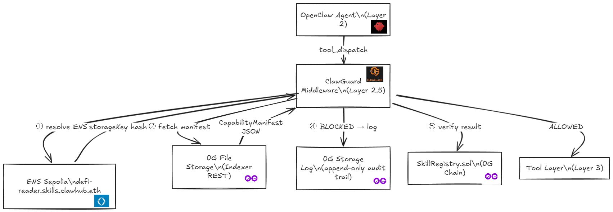

# ClawGuard 🛡️

> **Layer 2.5 Security Middleware for OpenClaw Agents — Built on 0G**  
> Declarative capability enforcement · Tamper-proof audit logs on 0G Storage · On-chain manifest registry on 0G Chain · Sealed verification via 0G Compute

[](https://www.npmjs.com/package/@shanejoans/clawguard)
[](https://chainscan-galileo.0g.ai)
[](https://chainscan-galileo.0g.ai/address/0x2205AC38725F42d9da0ffaDD94166B5E5b83010A)
[](https://app.ens.domains/clawhub.eth)
[](#testing)

---

## Project Overview

**ClawGuard** is a security middleware layer that sits between the OpenClaw orchestration framework and agent tool execution — intercepting every tool call, enforcing declarative capability manifests, and logging violations immutably to the 0G ecosystem.

**The Problem:** Autonomous AI agents (especially in DeFi/Web3) can silently exceed their intended permissions — calling `wallet.transfer` when they should only be reading balances. There is no standardized, verifiable way to enforce what an agent *can* and *cannot* do at runtime.

**Our Solution:** ClawGuard introduces a **zero-trust capability enforcement layer** that:
1. Parses a declarative `SKILL.md` manifest defining allowed/blocked tools
2. Stores manifests immutably on **0G Storage** (tamper-proof, content-addressed)
3. Anchors manifest integrity hashes on **0G Chain** via `SkillRegistry.sol`
4. Uses **0G Compute** (sealed inference) to verify agent code matches declared capabilities
5. Logs all violations as immutable audit records on **0G Storage**

> **Track:** Track 1 — Agentic Infrastructure & OpenClaw Lab

---

## 0G Integration Proof

ClawGuard deeply integrates **three core 0G components** across its entire stack:

### 1. 0G Storage — Manifest Registry & Audit Logs

| Usage | Description |
|---|---|
| **Manifest Storage** | Every `SKILL.md` capability manifest is uploaded to 0G File Storage via `Indexer.upload()`. The returned Merkle root hash serves as a content-addressable ID, ensuring manifests are tamper-proof and publicly verifiable. |
| **Violation Audit Logs** | When ClawGuard blocks an unauthorized tool call, the `ViolationEvent` is uploaded as a separate immutable file to 0G Storage. There is no delete API — the audit trail is append-only by construction. |
| **Integrity Verification** | At runtime, ClawGuard fetches the manifest from 0G Storage using the root hash and verifies its SHA-256 integrity before enforcing any rules (Security Rule S-03). |

**0G Storage Contracts & Links:**
- Flow Contract: `0x22E03a6A89B950F1c82ec5e74F8eCa321a105296`
- Turbo Indexer: `https://indexer-storage-testnet-turbo.0g.ai`
- Example Storage Tx: [`0x612b6cd6...`](https://chainscan-galileo.0g.ai/tx/0x612b6cd633e195f988cc685f6be43649be29859b5f47ae6a0e1f783a268079d1)

### 2. 0G Chain — SkillRegistry Smart Contract

| Usage | Description |
|---|---|
| **On-Chain Anchor** | `SkillRegistry.sol` stores the SHA-256 hash of every published skill manifest. This creates a permanent, publicly auditable record that a specific capability definition existed at a specific point in time. |
| **Skill Discovery** | Anyone can call `getSkillRecord(skillId)` to retrieve the manifest hash and verify it against the 0G Storage copy. |

**0G Chain Contract:**
- **SkillRegistry.sol:** [`0x2205AC38725F42d9da0ffaDD94166B5E5b83010A`](https://chainscan-galileo.0g.ai/address/0x2205AC38725F42d9da0ffaDD94166B5E5b83010A)
- Network: 0G Galileo Testnet (Chain ID `16602`)
- Explorer: [https://chainscan-galileo.0g.ai](https://chainscan-galileo.0g.ai)

### 3. 0G Compute — Sealed Capability Verification

| Usage | Description |
|---|---|
| **Code-vs-Manifest Verification** | `clawguard verify` sends the agent's source code to a Qwen model running on 0G Compute providers via sealed inference. The model analyzes whether the code actually matches its declared capabilities. |
| **On-Chain Badge** | After verification, a `VERIFIED` badge is anchored on 0G Chain, creating a trust signal for downstream consumers. |

**0G Compute:**
- Inference Contract: `0xa79F4c8311FF93C06b8CfB403690cc987c93F91E`
- Models: `qwen/qwen-2.5-7b-instruct`

---

## Architecture

```
OpenClaw Agent
     │
     ▼ tool_dispatch(tool, params)
┌────────────────────────────────────────────┐
│           ClawGuard Middleware (L2.5)        │
│                                            │
│  ① Resolve ENS name → clawguard.storageKey │
│  ② Fetch manifest ← 0G File Storage REST  │
│  ③ Verify SHA-256 hash (Rule S-03)        │
│  ④ Enforce allow/block lists              │
│  ⑤ Violations → 0G Storage Log           │
└────────────────────────────────────────────┘
     │ ✅ allowed                 │ 🚫 blocked
     ▼                            ▼
  Actual tool            ViolationEvent
  execution               (immutable, on 0G)
```

### Repository Structure

```
ClawGuard/
├── packages/
│   ├── core/              # @clawguard/core — middleware, 0G storage, ENS
│   │   └── src/
│   │       ├── manifest.ts     # SKILL.md parser + SHA-256 hashing
│   │       ├── middleware.ts   # wrapWithClawGuard() — main entry point
│   │       ├── storage.ts      # 0G Storage KV + file upload
│   │       └── ens.ts          # ENS resolution + subname registration
│   ├── contracts/         # Smart contracts (0G Chain)
│   │   ├── src/
│   │   │   ├── SkillRegistry.sol     # On-chain manifest anchor
│   │   │   └── ENSRegistrar.ts       # ENS subname management CLI
│   │   └── deployments/
│   ├── cli/               # @clawguard/cli — developer toolchain
│   │   └── src/
│   │       ├── index.ts        # CLI entry point
│   │       ├── publish.ts      # publish: SKILL.md → 0G Storage → 0G Chain → ENS
│   │       ├── verify.ts       # verify: 0G Compute sealed inference
│   │       └── inspect.ts      # inspect: read manifest from ENS / 0G Storage
│   └── example-agent/     # Demo agent with allowed + blocked skills
├── demo/                  # Spectra agent — end-to-end demo suite
└── frontend/              # Landing page
```

---

## 0G Modules & How They Support the Product

| 0G Module | How It Supports ClawGuard |
|---|---|
| **0G Storage** | Provides the tamper-proof, content-addressed data layer for storing capability manifests and immutable violation audit logs. Without 0G Storage, manifests could be silently modified by a compromised agent. |
| **0G Chain** | Anchors manifest hashes via `SkillRegistry.sol`, creating a permanent on-chain record of what capabilities a skill declared. Enables trustless, cross-party verification without needing to trust the manifest publisher. |
| **0G Compute** | Runs sealed Qwen inference to analyze whether agent source code matches its declared capabilities. Enables automated, verifiable audits of agent behavior — critical for agentic infrastructure trust. |

---

## Quick Start — Judge Setup Guide

### Prerequisites
- Node.js 20+
- A funded wallet on 0G Galileo Testnet

### 1. Clone & Install

```bash
git clone <repo>
cd ClawGuard
npm install
```

### 2. Configure Environment

```bash
cp .env.example .env
```

Fill in your private key. All other values have sensible defaults for 0G Galileo Testnet.

**Get testnet tokens:**
- **0G Galileo (OG):** https://faucet.0g.ai — needed for 0G Storage uploads + 0G Chain transactions
- **Sepolia (ETH):** https://sepoliafaucet.com — needed for ENS registration

### 3. Run the Pre-flight Check

```bash
npm run preflight
```

This verifies:
- ✅ All required env vars are set
- ✅ 0G Chain RPC is reachable (chainId 16602)
- ✅ 0G Storage Indexer is responding
- ✅ ENS resolution works (`defi-reader.skills.clawhub.eth`)
- ✅ SkillRegistry contract is callable
- ✅ Wallet balance ≥ 0.01 OG

### 4. Publish a Skill (Full Pipeline)

```bash
npx ts-node packages/cli/src/index.ts publish \
  packages/example-agent/skills/defi-reader \
  --description "Read-only DeFi price monitoring agent"
```

This single command:
1. Parses `SKILL.md` and computes a SHA-256 manifest hash
2. Uploads the manifest to **0G Storage** (tamper-proof, content-addressed)
3. Anchors the hash on **SkillRegistry.sol** (0G Chain)
4. Registers `defi-reader.skills.clawhub.eth` on ENS with text records

### 5. Verify a Skill (0G Compute)

```bash
npx ts-node packages/cli/src/index.ts verify \
  packages/example-agent/skills/defi-reader
```

Uses sealed Qwen inference on 0G Compute to verify code matches declared capabilities.

### 6. Inspect a Skill

```bash
# Resolve via ENS → fetch from 0G Storage
npx ts-node packages/cli/src/index.ts inspect defi-reader.skills.clawhub.eth
```

### 7. Run the Spectra Demo Agent

```bash
cd demo
npm install
cp .env.example .env   # fill in your keys
npm run spectra        # full end-to-end demo
```

---

## Using the Middleware (3 Lines of Code)

```typescript
import { wrapWithClawGuard, addViolationHandler } from '@shanejoans/clawguard';

// Wrap your OpenClaw agent's tool_dispatch
const dispatch = wrapWithClawGuard(myAgent.tool_dispatch, {
  agentId: 'defi-monitor-agent',

  // Load manifest from ENS → 0G Storage (production)
  ensName: 'defi-reader.skills.clawhub.eth',

  // Auto-upload violations to 0G Storage Log
  auditLog: true,
  zgStorageRpc:  process.env.ZG_CHAIN_RPC,
  zgIndexerRpc:  process.env.ZG_INDEXER_RPC,
  zgPrivateKey:  process.env.ZG_PRIVATE_KEY,

  failOpen: false, // fail-closed — block on any manifest fetch failure
});

// Every call now goes through ClawGuard
const result = await dispatch('wallet.read_balance', { address: '0x...' }, {
  skillId: 'defi-reader',
  sessionId: 'session-abc123',
});
```

---

## SKILL.md Format

Every agent skill declares its capabilities in a `SKILL.md` manifest:

```markdown
# DeFi Reader

Read-only DeFi market data agent.

## Allowed Tools
- wallet.read_balance
- web.fetch
- data.parse_json

## Blocked Tools
- wallet.transfer
- wallet.sign_transaction
- shell.exec

## Constraints
- max_external_calls_per_session: 10
- require_user_confirmation: false
```

ClawGuard parses this file, computes a SHA-256 hash, and uses it to verify manifest integrity at runtime.

---

## ENS Naming Scheme

```
{skillId}.skills.clawhub.eth
     │           │         │
  skill ID   subnode    parent
```

Each ENS subname stores these text records:

| Key | Value | Purpose |
|-----|-------|---------|
| `clawguard.storageKey` | `0xdd242a...` | 0G File Storage root hash (content ID) |
| `clawguard.manifestHash` | `0x3f5299...` | SHA-256 integrity anchor |
| `clawguard.registryAddr` | `0x2205AC...` | SkillRegistry contract on 0G Chain |
| `clawguard.status` | `ACTIVE` \| `REVOKED` | Revocation gate |

---

## Security Rules

| Rule | Description |
|---|---|
| **S-01** | Fail-closed by default — blocks all calls if manifest cannot be fetched |
| **S-02** | Violation events never include raw tool parameters (no key/secret leakage) |
| **S-03** | Manifest integrity verified via SHA-256 hash comparison at every fetch from 0G Storage |
| **S-04** | 0G Storage root hash is content-addressable — cannot be silently swapped |
| **S-05** | ENS subname revocation sets `REVOKED` status; middleware rejects revoked skills |

---

## Testing

```bash
# Unit tests (offline, no network)
npm run test --workspace=packages/core
# → 28/28 passed

# Integration tests (live 0G Galileo Testnet)
npx ts-node --project packages/core/tsconfig.json packages/core/integration.test.ts
# → 11/11 passed
```

**Integration test coverage (all on 0G Galileo):**
- ✅ T1: 0G Chain connectivity (chainId 16602)
- ✅ T2: 0G Storage — MemData upload
- ✅ T3: 0G Storage — Download + Merkle proof verification
- ✅ T4: 0G Storage — KV Batcher write (manifest)
- ✅ T5: 0G Storage — KV dynamic node discovery + read
- ✅ T6: 0G Storage — Violation log upload (tamper-proof)
- ✅ T7: 0G Chain — `registerSkill()` on SkillRegistry.sol
- ✅ T8: 0G Chain — `getSkillRecord()` read-back
- ✅ T9: 0G Compute — Provider discovery (2 providers found)

---

## Why 0G File Storage Instead of KV

During development we discovered that the Galileo testnet KV stream contract enforces strict `SenderNoWritePermission` with multi-hour ownership propagation latency. We engineered a pivot to **0G File Storage** via `Indexer.upload()`, which is fully open (any wallet can upload/read), returns deterministic Merkle root hashes, and is functionally equivalent to KV for our write-once, read-many manifest use case.

The `logViolation()` function also uses File Storage — each violation is a separate immutable file, making the audit trail append-only by construction (no delete API exists).

---

## Deployed Contracts & On-Chain Activity

| Contract | Network | Address | Explorer |
|---|---|---|---|
| `SkillRegistry.sol` | 0G Galileo (16602) | `0x2205AC38725F42d9da0ffaDD94166B5E5b83010A` | [View on 0G Explorer](https://chainscan-galileo.0g.ai/address/0x2205AC38725F42d9da0ffaDD94166B5E5b83010A) |
| `clawhub.eth` | Sepolia (ENS) | `0x2801Cd130F6dc93D89949476d70E2E6f033270EC` | [View on ENS](https://app.ens.domains/clawhub.eth) |

**0G Storage Upload Example:**
- Tx: [`0x612b6cd633e195f988cc685f6be43649be29859b5f47ae6a0e1f783a268079d1`](https://chainscan-galileo.0g.ai/tx/0x612b6cd633e195f988cc685f6be43649be29859b5f47ae6a0e1f783a268079d1)
- Root Hash: `0xdd242aedb2f82ee89fb4c2944781930c1a6b5d67869016d4c498a694a7af85f0`

---

## Environment Variables

| Variable | Required | Description |
|---|---|---|
| `ZG_PRIVATE_KEY` | ✅ | Wallet private key (hex) |
| `ZG_CHAIN_RPC` | ✅ | 0G Galileo EVM RPC |
| `ZG_INDEXER_RPC` | ✅ | 0G Storage indexer (turbo) |
| `ZG_FLOW_CONTRACT` | ✅ | 0G Flow contract address |
| `REGISTRY_ADDRESS` | ✅ | Deployed SkillRegistry address on 0G Chain |
| `ETH_SEPOLIA_RPC` | ✅ | Sepolia RPC for ENS |
| `ZG_KV_NODE_RPC` | ⬜ | KV node hint (auto-discovered if absent) |
| `ZG_STREAM_ID` | ⬜ | ClawGuard KV stream ID (has default) |

---

## Architecture Diagram



---

## Live Demo Outputs

### `clawguard publish` (0G Storage + ENS + 0G Chain)
```
🚀 ClawGuard — Publishing Skill

[Publish] Skill: defi-reader
[Publish] Manifest hash: 3f529942cf873214c8d53644c98a2f1300f04f790c4154cc0cbdda9090f65f70
[0G Storage] Manifest uploaded.
  Root: 0xdd242aedb2f82ee89fb4c2944781930c1a6b5d67869016d4c498a694a7af85f0
  Tx  : 0x612b6cd633e195f988cc685f6be43649be29859b5f47ae6a0e1f783a268079d1
[0G Chain] SkillRegistry: Skill already registered on-chain.
[ENS] Set clawguard.storageKey | tx: 0x0d5fb22758ec920ffc6a2763dc6599260a9376187924619fdf44e039d461f1ac
[ENS] Set clawguard.manifestHash | tx: 0xe6ef57955926a61fc8948fff5a16f93f8f18a3c1aca34940b7ef6a988d067a09
[ENS] ✅ defi-reader.skills.clawhub.eth registered
✅ Publish complete:
   0G Storage key: 0xdd242aedb2f82ee89fb4c2944781930c1a6b5d67869016d4c498a694a7af85f0
   Storage tx    : 0x612b6cd633e195f988cc685f6be43649be29859b5f47ae6a0e1f783a268079d1
```

### `clawguard inspect` (0G Storage + ENS)
```
🔎 ClawGuard — Inspecting Skill: defi-reader
  ENS Name  : defi-reader.skills.clawhub.eth     ← ACTIVE
  Registry  : 0x2205AC38725F42d9da0ffaDD94166B5E5b83010A
  Fetching manifest from 0G Storage...
  Allowed   : web.fetch, wallet.read_balance
  Blocked   : wallet.transfer, wallet.approve, shell.exec
  Delegation Gate — tool: "wallet.transfer"
  ⛔ DENIED: "wallet.transfer" is explicitly blocked for "defi-reader"
```

### Violation Auto-Uploaded to 0G Storage
```
[ClawGuard] BLOCKED: "wallet.transfer" is in the blocked_tools list
[0G Audit] ✅ Violation uploaded to 0G Storage Log
[0G Audit]    Skill    : rogue-defi-skill | Tool: wallet.transfer
[0G Audit]    Root hash: 0x<computed at runtime>
[0G Audit]    View     : https://storagescan-galileo.0g.ai/tx/<hash>
```

### On-Chain Verification via 0G Compute
```
🏅 Badge anchored on 0G Chain: VERIFIED
   Tx hash : 0x<computed at runtime>
   Explorer: https://chainscan-galileo.0g.ai/tx/<hash>
```

---

## License

MIT © ClawGuard Contributors
